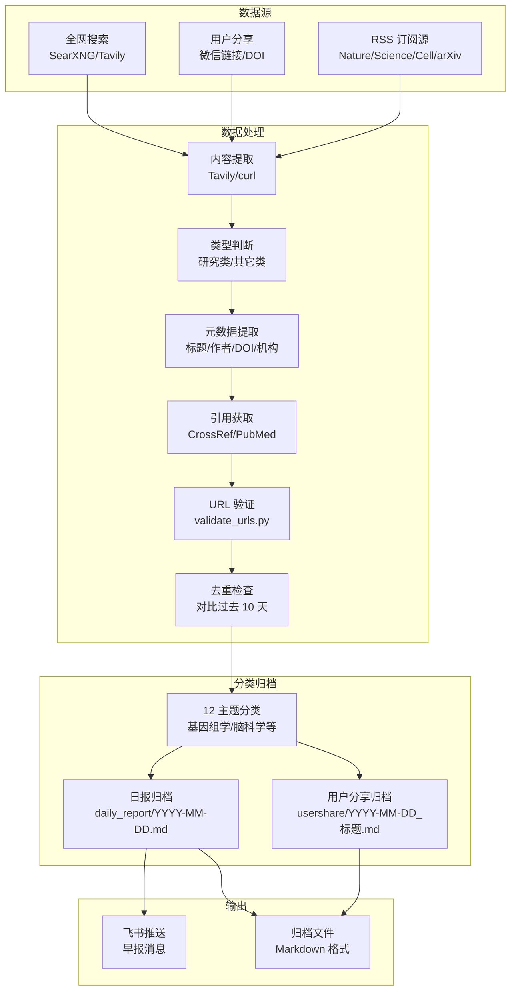
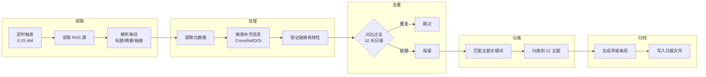
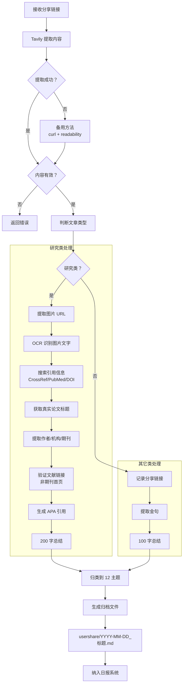
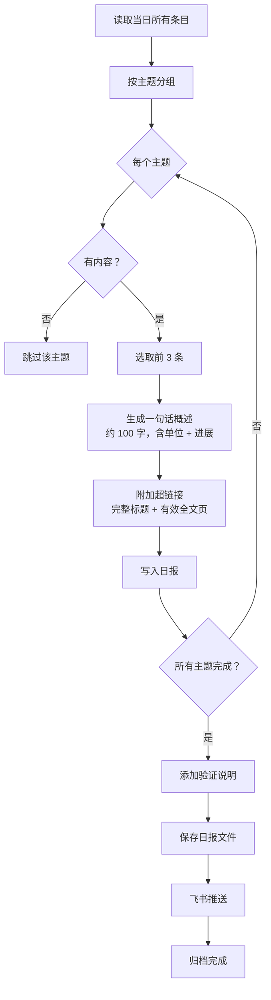
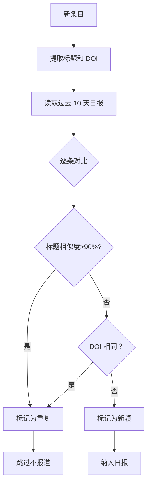

# 生命科学日报系统配置

## 系统说明

本系统自动抓取生命科学领域最新进展，每日凌晨 0:15 生成早报并归档。

---

## 系统架构图



---

## 工作流程详解

### 1. RSS 订阅处理流程



**RSS 源列表**：
- Nature 系列：genomics, neuroscience, synthetic-biology 等
- Science: current.xml
- Cell: cell/current.rss, cell-systems/current.rss
- arXiv: q-bio.GN, q-bio.OT
- PLOS, BMC 等

---

### 2. 用户分享文章处理流程



**研究类判定标准**：
- 包含实验数据、方法、结果
- 来自学术期刊、预印本平台
- 有明确的作者、单位、DOI
- 关键词：abstract, DOI, methods, results, 细胞，基因，蛋白等

**真实性验证**：
| 项目 | 验证方法 |
|------|---------|
| 论文标题 | 从学术 API 获取，不能删减 |
| 作者 | CrossRef/PubMed 验证 |
| 单位组织 | 从原文或学术数据库提取 |
| 期刊名 | Crossref/期刊官网验证 |
| DOI | 必须能解析到论文页面 |
| 文献链接 | validate_urls.py 验证可访问 |

---

### 3. 日报生成流程



**日报格式要求**：
- 按 12 主题顺序排列
- 空主题不呈现（直接跳过）
- 每项：一句话概述 + 超链接（完整标题）
- 一句话概述：约 100 字，必须含单位组织 + 最新进展
- 超链接：必须是论文全文页，不能用期刊首页

---

### 4. 去重规则流程



---

## 早报输出格式规范

### 1. 整体结构

- 按 12 个主题顺序排列
- 每个主题下逐项陈列论文/文献
- **如果主题里没有内容，该主题不呈现**（跳过）
- 只展示有实际内容的主题

### 2. 每项呈现格式

```
一句话概述（约 100 字，必须包括单位组织、最新进展描述），中文。如果找不到进展，就用完整标题的翻译
[不删减的真实论文标题](经过验证的有效文献网页链接)
```

**一句话陈述要求**：
- 约 100 字
- **必须包括**：单位组织（研究机构/大学/公司）
- **必须包括**：最新进展描述（发表了什么、发现了什么、突破了什么）
- 中文撰写
- 如果找不到具体进展，使用完整标题的中文翻译

**超链接要求**：
- 链接文字：**不删减的真实论文标题**（英文原文）
- 链接地址：**经过访问校对过的有效文献网页**
- **必须是**：论文全文页、新闻报道页等实际文章内容
- **禁止使用**：期刊首页、搜索页、作者主页
- 验证方法：用 `web_fetch` 或 `extract_content_from_websites` 确认可访问
- 用户分享的文章：优先找原文 DOI/全文链接，实在找不到才用分享链接（新闻报道）

### 3. 主题分类（12 个）

1. 基因组学 (Genomics)
2. 临床检测 (Clinical Diagnostics)
3. 细胞组学 (Cell Omics)
4. 时空组学 (Spatiotemporal Omics)
5. 合成生物学 (Synthetic Biology)
6. 生命科学大模型 (Life Science AI/LLM)
7. 细胞治疗 (Cell Therapy)
8. 类器官 (Organoids)
9. 衰老与发育 (Aging & Development)
10. 生命起源与极端环境生物 (Origin of Life & Extremophiles)
11. 脑科学 (Neuroscience)
12. 脑健康 (Brain Health)

---

## 用户分享文章归档规范

### 处理流程

1. **提取链接内容**
   - 使用 Tavily 提取工具 (`extract_with_tavily`) 获取网页内容
   - 提取失败时使用备用方法（curl + readability）

2. **判断文章类型**
   - **研究类**：包含实验数据、方法、结果，来自学术期刊/预印本平台，有作者/单位/DOI
   - **其它类**：新闻报道、科普文章、评论等

3. **研究类文章处理**
   
   **必须获取的信息**：
   - ✅ **真实论文标题**（从文字内容或配图 OCR 提取，不能删减）
   - ✅ **单位组织**（研究机构/大学/公司）
   - ✅ **作者**（完整作者列表或第一作者 + et al.）
   - ✅ **进展描述**（发表了什么、发现了什么、突破了什么）
   - ✅ **文献网页链接**（必须是论文全文页，不能用期刊首页充数，需验证可访问）
   - ✅ **分享网页链接**（原始分享链接）
   - ✅ **全文总结**（200 字，包含核心发现/方法/意义）
   
   **引用格式（APA/Nature）**：
   ```
   作者。文章标题。期刊名 (发表年份). DOI 链接
   ```
   
   示例：
   ```
   Smith, J., & Wang, L. CRISPR-based gene editing in human embryos. Nature (2025). https://doi.org/10.1038/s41586-025-xxxxx
   ```
   
   **搜索工具优先级**：
   1. CrossRef API（通过 DOI）
   2. PubMed（通过 DOI 或标题）
   3. Google Scholar / Baidu Scholar
   4. SearXNG 搜索增强
   
   **URL 验证要求**：
   - 必须能访问到论文全文或摘要页面
   - 不能用期刊首页、搜索页、作者主页充数
   - 使用 `web_fetch` 或 `curl` 验证状态码为 200
   - 提取到论文标题/摘要才认为有效

4. **其它类文章处理**
   - 记录分享链接
   - 保留金句（原文中的关键语句）
   - 总结全文（100 字）

5. **归类到 12 个主题**
   - 根据研究内容匹配主题关键词
   - 每个归档文件标注所属主题

6. **生成归档文件**
   - 位置：`~/advances/usershare/YYYY-MM-DD_论文标题.md`
   - 每个项目生成单独的 .md 文件

### 归档文件模板

```markdown
# 论文标题

**归档日期**: YYYY-MM-DD  
**类型**: 研究类/其它类  
**分享链接**: https://...  
**所属主题**: 基因组学/脑科学/...

## 📌 核心信息

- **单位**: 研究机构名称
- **团队**: 研究团队（可选）
- **科研突破**: 具体突破描述
- **使用技术**: 技术方法
- **重要成果**: 主要发现
- **产业应用**: 应用前景

## 📖 引用格式 (APA/Nature)

作者。文章标题。期刊名 (发表年份). DOI 链接

## 📎 元数据

- **作者**: 完整作者列表
- **机构**: 研究机构
- **期刊**: 期刊名称
- **年份**: 发表年份
- **DOI**: 10.xxxx/xxxxx
- **文献链接**: https://...（验证有效的全文页）

## 📝 全文总结

200 字总结（研究类）或 100 字总结（其它类），包含核心发现、方法、意义。

---
**原文来源**: 分享链接
```

### 真实性要求

**所有归档内容必须保证真实性**：

| 项目 | 要求 |
|------|------|
| 论文标题 | 必须真实，不能删减或修改 |
| 作者 | 必须真实，从学术 API 或原文获取 |
| 单位组织 | 必须真实，不能编造 |
| 期刊名 | 必须真实，从 Crossref/期刊官网验证 |
| DOI | 必须真实，能解析到论文页面 |
| 文献链接 | 必须能访问到全文/摘要页，不能用首页充数 |
| 年份 | 必须真实，从期刊或预印本平台获取 |

**验证工具**：
- Crossref API：验证 DOI、作者、期刊
- PubMed：验证生物医学论文
- SearXNG：多引擎搜索验证
- web_fetch：验证链接可访问性

---

## RSS 信息源

### Nature 系列
- https://www.nature.com/subjects/genomics.rss
- https://www.nature.com/subjects/transcriptomics.rss
- https://www.nature.com/subjects/proteomics.rss
- https://www.nature.com/subjects/bioinformatics.rss
- https://www.nature.com/subjects/synthetic-biology.rss
- https://www.nature.com/subjects/neuroscience.rss

### arXiv
- https://arxiv.org/rss/q-bio.GN
- https://arxiv.org/rss/q-bio.OT

### PLOS
- https://journals.plos.org/plosgenetics/feed/atom
- https://journals.plos.org/ploscompbiol/feed/atom

### BMC
- https://bmcgenomics.biomedcentral.com/feed

### Science
- https://www.science.org/rss/current.xml

### Cell
- https://www.cell.com/cell/current.rss
- https://www.cell.com/cell-systems/current.rss

## 搜索关键词配置

### 各主题关键词 (用于全网搜索)

```json
{
  "基因组学": ["genomics", "genome sequencing", "whole genome", "clinical genomics", "基因组测序"],
  "临床检测": ["clinical diagnostics", "biomarker", "liquid biopsy", "molecular diagnostics", "临床检测"],
  "细胞组学": ["single cell", "scRNA-seq", "cell atlas", "transcriptomics", "单细胞"],
  "时空组学": ["spatial transcriptomics", "spatial omics", "spatial proteomics", "空间组学"],
  "合成生物学": ["synthetic biology", "gene circuit", "metabolic engineering", "合成生物学"],
  "生命科学大模型": ["protein folding", "AlphaFold", "biology AI", "drug discovery AI", "生物大模型"],
  "细胞治疗": ["CAR-T", "cell therapy", "immunotherapy", "stem cell therapy", "细胞治疗"],
  "类器官": ["organoid", "organ-on-chip", "3D culture", "类器官"],
  "衰老与发育": ["aging", "senescence", "developmental biology", "longevity", "衰老", "发育"],
  "生命起源与极端环境生物": ["origin of life", "extremophile", "astrobiology", "primordial", "生命起源"],
  "脑科学": ["neuroscience", "neural circuit", "brain mapping", "connectome", "神经科学"],
  "脑健康": ["Alzheimer", "Parkinson", "neurodegeneration", "brain disease", "脑健康"]
}
```

## 归档规则

### 研究类文章判定标准
- 包含实验数据、方法、结果
- 来自学术期刊、预印本平台
- 有明确的作者、单位、DOI

### 去重规则
- 对比过去 10 天日报中的标题和 DOI
- 相同内容不重复报道
- 用户分享的内容需纳入主题归类

## API 调用统计

系统记录每次大模型 API 调用：
- 日期
- 类型 (早报生成/文章处理)
- Token 使用量
- 累计调用次数

日志位置：~/advances/code/api_usage.log

## Cron 任务配置

```bash
# 每日凌晨 0:15 生成早报
15 0 * * * /root/advances/code/generate_daily_report.sh >> /root/advances/code/cron.log 2>&1
```

## 文件结构

```
~/advances/
├── readme.md              # 本配置文件（含格式规范 + 流程图）
├── daily_report/          # 日报归档
│   └── YYYY-MM-DD.md      # 每日早报（完整格式）
├── usershare/             # 用户分享文章归档
│   └── YYYY-MM-DD_项目名.md
└── code/                  # 脚本和程序
    ├── generate_daily_report.py    # 日报生成
    ├── generate_daily_report.sh    # cron 调用
    ├── process_article.py          # 文章处理（带 Tavily 提取）
    ├── validate_urls.py            # URL 验证
    ├── fetch_citation.py           # 引用获取
    ├── api_tracker.py              # API 统计
    ├── README.md
    └── cron.log
```
